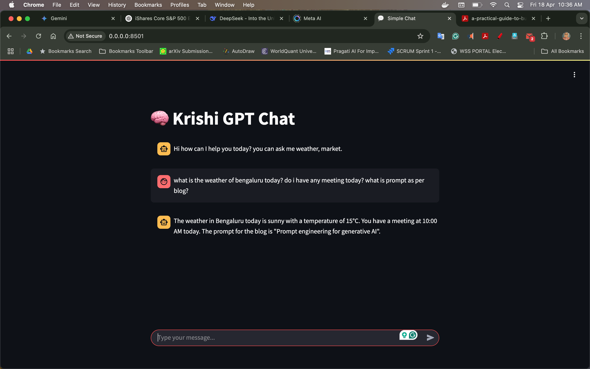

# Google ADK Multi Agent Ollama Application

Still this is the only Google ADK Ollama multi Agent application to run locally.

# image of krishigpt chatbot


## Prerequisites

* Python 3.11 or higher
* pip (Python package installer)
* A Google Cloud Platform (GCP) account (for Gemini API access) will be good

## Installation

1.  **Fork and Clone the Repository (if applicable):**

    ```bash
    git clone <your_repository_url>
    cd <your_application_directory>
    ```

2.  **Create an `.env` file:**

    Create a file named `.env` from env_copy in the root directory of your project. This file will store your API keys and other sensitive information.

    ```
    GOOGLE_API_KEY=<your_google_api_key>
    LANGCHAIN_API_KEY=<your_langsmith_api_key>
    LANGCHAIN_TRACING_V2="true"
    LANGCHAIN_PROJECT="Your_LangGraph_Project_Name"
    Antyhing else api key etc
    WEATHER_API_KEY=your-key
    USER_AGENT=MyLangGraphBot/1.0
    # MODEL=gemma3:4b
    MODEL=llama3.1:8b
    # BASE_URL=http://ollama_server_lite:11434
    BASE_URL=http://ollama_server:11434
    REMOTE_BASE_URL=https://models.github.ai/inference
    REMOTE_MODEL=openai/o4-mini
    ```

## Obtaining API Keys

### 1. Google Gemini API Key [optional]

1.  **Go to Google AI Studio:**
    * [Google AI Studio](https://makersuite.google.com/)
2.  Follow the instructions to create a project and obtain an API key.
3.  Alternatively, you can obtain a Google Cloud API key from the google cloud console.
    * [Google Cloud Platform](https://cloud.google.com/)
4.  Enable the Gemini API for your project.
5.  Create API credentials.
6.  Add the key to your `.env` file as `GOOGLE_API_KEY`.

## Running the Application

1.  **Navigate to your application directory:**

    ```bash
    cd <your_application_directory>
    docker-compose up --build
    ```

2.  **Run the application using the `ADK` CLI [optional]:**

    ```bash
    adk web
    ```

## Google ADK Local Development Notes.

* https://developers.googleblog.com/en/agent-development-kit-easy-to-build-multi-agent-applications


* 🐳 Running with Docker Compose
You can also run the application using Docker Compose, which will spin up both the LangGraph agent and Ollama server.

* Start the services
`docker-compose up --build`

* To stop
ctrl + c

and

`docker-compose down --remove-orphans`

Always check the Docker images and containers. Keep your system and dangling images removed otherwise you system can freeze.

* This will launch:

🚀 agent_service: Your LangGraph agent on http://localhost:5000

🧠 ollama_server: The local model server running on http://localhost:11434

Use this for full isolation and easy multi-service orchestration. Recommended system at least 16 GB or 32 GB RAM, optional GPU, i7 or similar. As LLM will be downloaded into your docker container and it require around 5 GB. Higher system will run faster otherwise slow for response to keep patience. 

